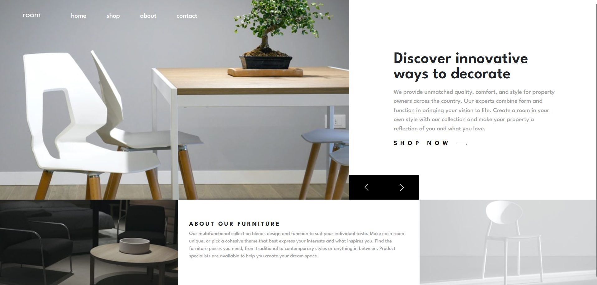

# Frontend Mentor - Room homepage solution

This is a solution to the [Room homepage challenge on Frontend Mentor](https://www.frontendmentor.io/challenges/room-homepage-BtdBY_ENq). Frontend Mentor challenges help you improve your coding skills by building realistic projects. 

## Table of contents

- [Overview](#overview)
  - [The challenge](#the-challenge)
  - [Screenshot](#screenshot)
  - [Links](#links)
- [My process](#my-process)
  - [Built with](#built-with)
  - [Continued development](#continued-development)
- [Author](#author)

## Overview

### The challenge

Users should be able to:

- View the optimal layout for the site depending on their device's screen size
- See hover states for all interactive elements on the page
- Navigate the slider using either their mouse/trackpad or keyboard

### Screenshot

### Links

- Live Site URL: [Add live site URL here](https://your-live-site-url.com)

## My process
I followed the design images provided by Frontend Mentor and made a few changes. 
I wanted to create a soft feeling by adding some slide animations and hover effects.

### Built with

- Semantic HTML5 markup
- Sass
- Bootstrap
- TypeScript
- Mobile-first workflow

### Continued development

These are things I will continue to practise in my next projects: 
- Animations and hover effects
- Responsive layout 
- Creative navbars 

## Author

- Website - [Hanna Björling](https://www.your-site.com)
- Frontend Mentor - [@hannabjorling](https://www.frontendmentor.io/profile/hannabjorling)
